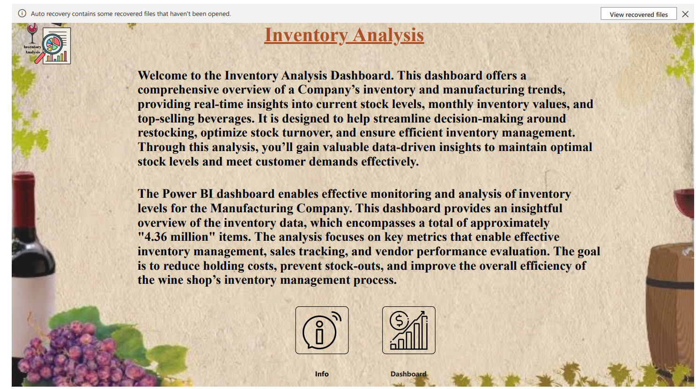
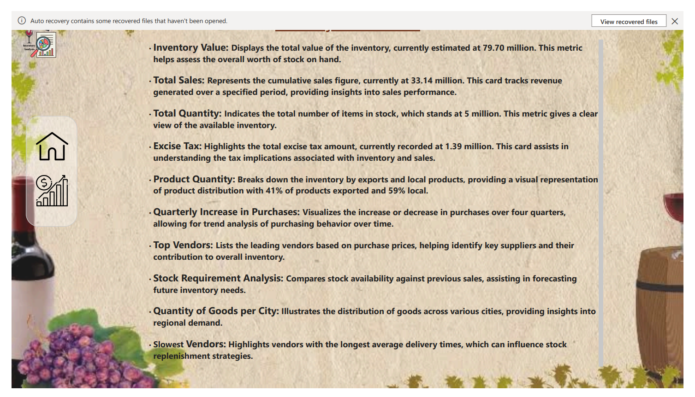
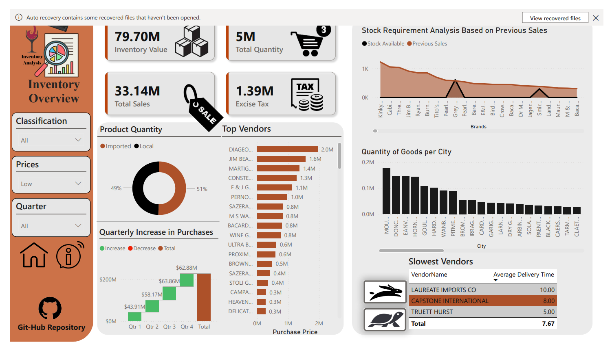

# 🏢 Inventory Analysis Dashboard

Welcome to the **Inventory Analysis Dashboard**! This tool provides insights into the Company’s inventory and manufacturing data, supporting effective stock management and improved turnover.

## 🚀 Key Features
- **Real-Time Metrics**: View total inventory value, stock levels, excise tax, and product quantities.
- **Trend Analysis**: Track quarterly purchasing trends and vendor performance.
- **Data-Driven Insights**: Make informed decisions with visibility on stock, sales, and top-selling items.

## 📈 Key Metrics
- **Inventory Value**: $79.7M 
- **Total Sales**: $33.1M 
- **Total Stock**: 5M items
- **Excise Tax**: $1.39M
- **Product Distribution**: 41% exported, 59% local

## ✨ Highlights
- **Top-Selling Products**: Focus on best-sellers to maximize profits.
- **Vendor Insights**: Evaluate vendors by purchase rate and delivery speed.
- **Stock Efficiency**: Monitor turnover and optimize inventory.
